<div align="center">

# 🚗 ROS 2 Tempomat Szimuláció (Integer Verzió)

**Egy determinisztikus, egész számokon alapuló tempomat projekt, amely bemutatja a ROS 2 alapvető koncepcióit egy kifinomult szabályozási logikával.**

</div>

---

## ✨ Főbb Jellemzők

* **Tiszta Egész Számos Működés:** A rendszer kizárólag `integer` típusú adatokkal dolgozik, elkerülve a lebegőpontos számításokból adódó pontatlanságokat.
* **Korlátozott Arányos Szabályozás:** A gyorsítás és lassítás mértéke arányos a sebességkülönbséggel, de egy szigorúan meghatározott **[1, 5] km/h** tartományon belül marad.
* **Determinisztikus Viselkedés:** A rendszer minden helyzetben kiszámíthatóan és következetesen működik.
* **Letisztult Visszajelzés:** A terminálban másodpercenként kapunk egyértelmű, formázott státuszüzenetet a jármű állapotáról.
* **Moduláris Felépítés:** Két különálló node felel a vezérlési logika és a járműszimuláció feladatáért.

---

## ⚙️ Rendszerarchitektúra

A projekt egy klasszikus **zárt szabályozási kört (closed-loop)** valósít meg, ahol a komponensek `Int32` típusú üzenetekkel kommunikálnak.

1.  `cruise_control_node` (Az "Agy")
    * Feliratkozik a felhasználó által beállított `/target_speed`-re és a jármű által közölt `/current_speed`-re.
    * Kiszámolja a sebességkülönbséget (`hiba`).
    * A hiba alapján egy arányos parancsot generál, amit a `[1, 5]`-ös abszolút értékű tartományba korlátoz.
    * A korlátozott, egész számos parancsot a `/speed_change_command` topicon publikálja.

2.  `speed_sensor_node` (A "Jármű")
    * Feliratkozik a `/speed_change_command` topicra.
    * A kapott egész számos parancs alapján frissíti a belső sebesség-állapotát.
    * Az új sebességét a `/current_speed` topicon publikálja, ezzel bezárva a kört.

### Adatfolyam Diagram

```mermaid
graph LR
    subgraph Controller [🧠 cruise_control_node]
        direction TB
        A[Sub: /target_speed] -- Int32 --> C{Control Logic};
        B[Sub: /current_speed] -- Int32 --> C;
        C -- Raw Int Command --> D{"Clamping [1, 5]"};
        D -- Final Int Command --> E(Pub: /speed_change_command);
    end

    subgraph Vehicle [🚗 speed_sensor_node]
        direction TB
        F[Sub: /speed_change_command] -- Int32 --> G{Physics Update};
        G -- New Int Speed --> H(Pub: /current_speed);
    end

    Controller -- Int32 Command --> Vehicle;
    Vehicle -- Int32 Feedback --> Controller;

    User([👨‍💻 User]) -- ros2 topic pub --> A;

    classDef default fill:#282a36,stroke:#f8f8f2,color:#f8f8f2
    classDef nodeStyle fill:#44475a,stroke:#50fa7b
    classDef topicStyle fill:#6272a4,stroke:#8be9fd
    class Controller,Vehicle nodeStyle
    class A,B,E,F,H topicStyle
```



---

## 🚀 Telepítés és Futtatás

### 1. Fordítás

Navigálj a ROS 2 workspace gyökerébe és fordítsd le a csomagot.

```bash
cd ~/ros2_ws
colcon build --packages-select var_kqt_beadando
```

### 2. Rendszer Indítása

Egy új terminálban "source"-old a workspace-t, majd indítsd el a rendszert a launch fájllal.

```bash
source ~/ros2_ws/install/setup.bash
ros2 launch var_kqt_beadando tempomat.launch.py
```
> **Várt kimenet:** A két node elindul, és másodpercenként megjelenik a státuszüzenet:
> `[cruise_control_node]: Jármű sebessége: 0 km/h | Tempomat: 0 km/h | Változás mértéke: 0 km/h`

### 3. Tempomat Kezelése

Egy **másik terminálban** küldj parancsokat a tempomatnak. **Figyelem, a típus `std_msgs/msg/Int32`!**

#### Célsebesség beállítása:
```bash
# Célsebesség 100 km/h
ros2 topic pub /target_speed std_msgs/msg/Int32 "{data: 100}"
```
*Figyeld az első terminált! A jármű sebessége gyorsan, de maximum 5 km/h-s lépésekben fog nőni. Ahogy közeledik a célhoz, a lépésméret lecsökken, de sosem lesz 1-nél kevesebb, amíg el nem éri a 100-at.*

#### Tempomat kikapcsolása (lassítás nullára):
```bash
ros2 topic pub /target_speed std_msgs/msg/Int32 "{data: 0}"
```
*A jármű arányosan, a szabályoknak megfelelően fog lelassulni és megállni.*